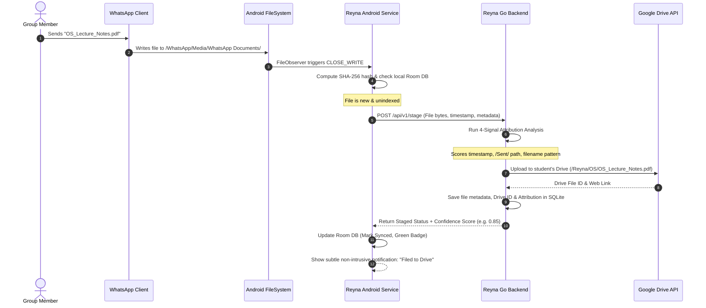
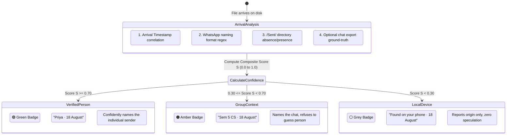
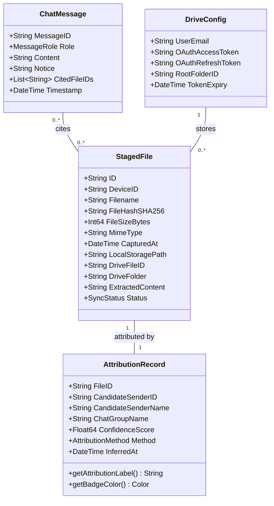

# Reyna — System Architecture & Design Specification

> **"The project file you need is already on your phone."**
> Reyna is an intelligent, privacy-first document system that turns messy WhatsApp groups into a searchable, self-filing digital library—without requiring a single manual upload or adding bots to group chats.

---

## 1. Executive Summary: What is Reyna in Plain English?

In colleges and workplaces across India and beyond, collaboration happens almost exclusively on **WhatsApp groups**. Lecture notes, project reports, past question papers (PYQs), and assignment guidelines are constantly shared.

However, within 24 hours, those critical documents are buried under hundreds of messages, memes, and daily greetings. When exam season or project review day arrives, students spend hours scrolling through chat histories or asking: *"Can someone re-send the Module 2 notes?"*

### Why Traditional Portals Fail
Institutions spend millions trying to force students onto central upload portals. **Almost nobody uses them.** Students have to stop what they are doing, convert files, log into an awkward web portal, fill out metadata forms, and upload. Because the friction is high, portals become ghost towns, and faculty never know who actually contributed what.

### The Reyna Breakthrough: Zero-Upload Architecture
Reyna flips this model completely:

1. **No Manual Uploads:** You don't upload files. Reyna watches the files WhatsApp *already* downloads to your Android phone's storage.
2. **No Bots in the Group:** There is no "+1 (555) Bot" in your group chat. WhatsApp cannot ban you, and nobody's private chats are exposed.
3. **Automatic Cloud Archiving:** As files land, Reyna files them directly into your **personal Google Drive**.
4. **Who Shared It (Attribution):** A file saved to storage has no sender label. Reyna inspects arrival timing, filename patterns, and sent folders to reconstruct who shared it with mathematical confidence.
5. **Ask in Plain English:** Months later, simply ask: *"Where are the notes for Module 1 ODE?"* Reyna finds the exact file, cites who sent it, gives you a one-tap button to open it, and answers follow-up questions just like a human research assistant.

---

## 2. Core Architectural Principles

```
┌─────────────────────────────────────────────────────────────────────────────┐
│                            REYNA'S FOUR PILLARS                             │
├───────────────────────┬──────────────────────────┬──────────────────────────┤
│    🔒 Zero Hostage    │      🤖 Zero Bots        │    🎯 Never Guess        │
│ Files go directly to  │ Nothing joins WhatsApp   │ If confidence < 0.70,    │
│ your personal Google  │ groups. Zero risk of     │ Reyna refuses to name    │
│ Drive. No documents   │ phone number bans or     │ a person. A wrong name   │
│ on central servers.   │ privacy intrusion.       │ is worse than no name.   │
└───────────────────────┴──────────────────────────┴──────────────────────────┘
```

1. **Zero Central Document Storage:** Reyna never hoards documents on central company servers. Everything stays on the user's device and their own private Google Drive storage.
2. **Zero Bot Vulnerability:** Traditional WhatsApp bots get blocked, banned, or rate-limited by Meta. Reyna runs client-side using Android system file monitoring.
3. **Strict Attribution Thresholds:** Reconstructing senders uses a strict confidence floor (0.70). If evidence is insufficient, Reyna honestly states the file was found on your phone rather than guessing.
4. **Extreme Resource Efficiency:** The Go backend has only **two external dependencies** (`jwt` and `go-sqlite3`). Office files (`.docx`, `.pptx`, `.xlsx`) are parsed locally without spending expensive AI API calls.

---

## 3. High-Level UML Architecture Diagram

```mermaid
flowchart TB
    subgraph AndroidClient ["📱 Android Device (Client Side)"]
        direction TB
        WA["WhatsApp App<br/>(Normal Daily Usage)"]
        FS["Android Media Storage<br/>(/Android/media/com.whatsapp/...)"]
        FO["FileObserver Daemon<br/>(Detects CLOSE_WRITE events)"]
        RoomDB[("Local Room SQLite<br/>(Cache, Sync Queue, Chat)")]
        ComposeUI["Jetpack Compose UI<br/>(Chat, Search, Sources, Notices)"]
        SyncMgr["Sync & Upload Engine<br/>(Retrofit / OkHttp)"]

        WA -->|Writes files| FS
        FS -->|Notifies| FO
        FO -->|Stages new file| RoomDB
        RoomDB --> SyncMgr
        ComposeUI <--> RoomDB
        ComposeUI <--> SyncMgr
    end

    subgraph CloudBoundary ["☁️ Secure Network & Cloud Services"]
        Tunnel["Secure Gateway / Tunnel<br/>(ngrok permanent domain / HTTPS)"]
        GDrive["Google Drive API v3<br/>(User's Personal Drive)"]
        GeminiAI["Gemini 2.5 Flash API<br/>(Selective RAG Synthesis)"]
    end

    subgraph GoBackend ["⚙️ Reyna Backend Server (Go + SQLite)"]
        direction TB
        Router["HTTP Router & API Handlers<br/>(/api/v1/stage, /api/v1/ask, etc.)"]
        AttrEngine["Attribution Engine<br/>(4-Signal Confidence Scorer)"]
        DocExtractor["Zero-Cost Doc Extractor<br/>(Pure Go XML/ZIP for Office)"]
        Ranker["Relevance Ranker & NLP<br/>(Whole-word matching, Tokenizer)"]
        ServerDB[("Backend SQLite<br/>(Metadata, Auth, Attribution)")]
        QuotaGate["Quota & Rate Governor<br/>(Fast-fail allowance guard)"]

        Router <--> AttrEngine
        Router <--> DocExtractor
        Router <--> Ranker
        Router <--> QuotaGate
        AttrEngine <--> ServerDB
        Ranker <--> ServerDB
    end

    SyncMgr <==>|Encrypted HTTPS| Tunnel
    Tunnel <==> Router
    Router <==>|Uploads files & organizes| GDrive
    DocExtractor -.->|PDFs only (on-demand)| GeminiAI
    Ranker -.->|Answer synthesis| GeminiAI
```

---

## 4. Component Breakdown & Responsibilities

### 4.1 Android Client Layer (`app.reyna`)
* **`FileObserver` Service:** Registers an operating system hook on the WhatsApp media storage directory. When a file is written and the file handle is closed (`CLOSE_WRITE`), the observer immediately wakes up.
* **Local Room Database (`Db.kt`):** Maintains an offline-first catalog of all detected documents, staging states, attribution confidence, and chat interaction logs.
* **Smart Word Tokenizer (`Words.kt`):** Mirrors the server's linguistic tokenization, splitting strings on non-alphanumeric boundaries and letter/number transitions (e.g., distinguishing `"Module 1"` from `"Module4_part1"`).
* **Jetpack Compose UI:**
  * **Conversational Screen:** Interactive chat with multi-turn query continuity.
  * **Attribution Badges:** Triad color system indicating confidence (Green for verified person, Amber for group, Grey for on-device).
  * **Sources Component:** Expandable drawer displaying cited documents with one-touch opening.
  * **Notice Component:** Amber cards that display system state (e.g., daily API allowance reset times) without confusing the user with error alerts.

### 4.2 Go Backend Engine (`cmd/server`, `internal/`)
* **Lightweight Core:** Designed to run on modest infrastructure with zero runtime bloat.
* **Local Office Parser (`internal/docs`):** Uses Go's native `archive/zip` and `encoding/xml` to instantly read `.docx`, `.pptx`, and `.xlsx` files without external libraries, OCR overhead, or API charges.
* **On-Demand Content Extractor (`ensureContent`):** Reads document contents only when a user's question actually targets them, caching results forever.
* **Conversational Ranker (`internal/relevance`):** Replaces basic string matching with a dual-pass relevance engine:
  * Pass 1: SQL broad-recall net.
  * Pass 2: In-memory whole-word scoring where title matches carry heavy weight (25 points) compared to passing body mentions (4 points).
* **Smalltalk Fast-Path (`internal/nlp/smalltalk.go`):** Instantly responds to greetings ("hi", "thanks", "who are you") without triggering document scans, saving quota.

---

## 5. Key Workflows (UML Sequence Diagrams)

### 5.1 File Ingestion & Attribution Sequence



---

### 5.2 Conversational Question & Retrieval Sequence

```mermaid
sequenceDiagram
    autonumber
    actor User as Student / User
    participant UI as Compose Chat UI
    participant Srv as Reyna Go Backend
    participant DB as SQLite DB
    participant AI as Gemini 2.5 Flash

    User->>UI: Types: "What is the grading policy in the syllabus?"
    UI->>Srv: POST /api/v1/ask (Query: "...", History: [...])
    Srv->>Srv: Check Smalltalk Filter & Quota Gate
    Note over Srv: Not smalltalk; Quota available
    Srv->>Srv: Strip query phrases ("what is the", "in the")
    Srv->>DB: Query candidate files matching keywords ("grading", "policy", "syllabus")
    DB-->>Srv: Return candidate records
    Srv->>Srv: Relevance Ranker scores candidates (Title vs Body weights)
    Note over Srv: Syllabus_Fall2026.pdf chosen (Score: 54.0)
    opt Content not yet extracted
        Srv->>AI: Extract clean text & topics from target PDF
        AI-->>Srv: Extracted text
        Srv->>DB: Cache extracted text
    end
    Srv->>AI: Synthesize conversational answer with context & verified source
    AI-->>Srv: Plain English explanation citing Syllabus_Fall2026.pdf
    Srv-->>UI: Return JSON { Answer: "...", Sources: [Syllabus_Fall2026.pdf], Notice: null }
    UI->>UI: Render chat bubble + clickable "Sources (1)" button
    User->>UI: Clicks "Sources (1)"
    UI->>UI: Expand bottom sheet showing Syllabus file with Drive open button
```

---

## 6. The Attribution Engine: How Reyna Knows Who Shared It

A raw file sitting in Android storage has no author tag. It is just bytes on disk. Reyna solves this by acting as a digital forensic investigator combining **four independent signals**:



### The Iron Rule of Attribution
> **"A wrong name is infinitely worse than no name."**
If attribution confidence falls below `0.70`, the system will **never** display a person's name. It will downgrade gracefully to chat-level or device-level origin.

---

## 7. Data Models & Schema Design (UML Class Diagram)



---

## 8. Technology Stack Summary

| Layer | Technologies Used | Key Reason for Selection |
| :--- | :--- | :--- |
| **Android Client** | Kotlin, Jetpack Compose, Room DB, Android `FileObserver` | Zero-battery-drain filesystem hooks, native performance, modern reactive UI. |
| **Backend Server** | Go (Golang 1.22+), SQLite (`mattn/go-sqlite3`), `golang-jwt` | Single standalone binary, sub-millisecond execution, only 2 external dependencies. |
| **Local Document Parsing** | Go `archive/zip` & `encoding/xml` | Reads `.docx`, `.pptx`, `.xlsx` natively with 0ms latency and zero LLM cost. |
| **AI / Retrieval** | Gemini 2.5 Flash, Whole-Word Ranked BM25-style scoring | Cost-efficient RAG, multi-lingual question answering, strict context enforcement. |
| **Cloud Storage** | Google Drive API v3 | Keeps data in student's own ownership; zero centralized hosting liabilities. |
| **Networking** | ngrok reserved domain / cloudflared tunnels | Permanent webhook and OAuth callback URLs without manual DNS reconfiguration. |

---

## 9. Security, Privacy & Ethics

1. **No Group Spying:** Reyna never parses user chat messages in groups. It inspects only documents downloaded to disk.
2. **User Data Sovereignty:** Files travel directly between the user's phone and their personal Google Drive.
3. **Transparent Notices:** If the system is out of API allowance, it displays a polite amber notice with the exact time of quota replenishment, rather than failing silently or inventing answers.
4. **Resilient to Platform Updates:** Because Reyna interfaces with Android's scoped media storage rather than scraping WhatsApp's private memory or hooking WhatsApp's app binary, it is fully compliant with Android security sandboxing.

---

## 10. Operational Playbook & Invariants (For Future AI & Developers)

> **CRITICAL CONTEXT FOR AI ASSISTANTS:**
> This section documents the operational environment, active codebases, and hard-won engineering invariants. Adhering to these rules guarantees that future coding sessions will not regress previous bug fixes.

### 10.1 Workspace Disambiguation
* **Active Repository:** `/Users/harsh/code/reyna-app`
  This contains the active Android client (`android/app/...`), Go backend server (`cmd/`, `internal/`), and `justfile`.
* **Legacy Repository:** `/Users/harsh/code/reyna`
  This was the initial v0.1 prototype (Baileys bot + React dashboard). The Baileys WhatsApp bot and web frontend are obsolete. Always verify you are editing in `/Users/harsh/code/reyna-app` for active application code.

### 10.2 Environment & Build Commands

| Task | Command (`justfile` in `reyna-app`) | Description |
| :--- | :--- | :--- |
| **Run Backend** | `just backend-bg` | Builds and starts server on `:8080` detached with `nohup`. Uses `-sTCP:LISTEN` so tunnels are not killed. |
| **Start Tunnel** | `just tunnel-up` | Starts permanent ngrok domain (`superformally-reckonable-etha.ngrok-free.dev`). |
| **Build Debug APK** | `just build` | Assembles debug Android APK. |
| **Build Release APK** | `just apk-release` | Builds signed production APK to `~/Desktop/reyna.apk` and `Reyna_APKs/`. |
| **Run Linter & Tests** | `just check` | Runs `go vet` and all package tests. |
| **Device Logs** | `just logs` | Streams Android logcat filtered for `app.reyna`. |

#### Android Emulator (AVD) Configuration
* **SDK Location:** `/opt/homebrew/share/android-commandlinetools` (`sdk.dir` in `local.properties`).
* **AVD Name:** `reyna_pixel` (arm64, Android API 35).
* **Headless Launch:**
  ```bash
  export ANDROID_HOME=/opt/homebrew/share/android-commandlinetools
  export PATH=$ANDROID_HOME/platform-tools:$ANDROID_HOME/emulator:$PATH
  emulator -avd reyna_pixel -no-snapshot-load -gpu swiftshader_indirect &
  ```
* **Switching Targets:**
  * Emulator: `just point-at-emulator` then `just build`.
  * Release / Device: `just point-at <tunnel url>` before building release.

### 10.3 The Ten Invariants (Never Regress These)

1. **Strict 0.70 Attribution Floor:** A file on disk carries no author. Reyna reconstructs senders from 4 signals. If confidence is below `0.70`, **never name a person**. Downgrade to chat name or "Found on your phone". A wrong name destroys user trust.
2. **Whole-Word Matching Only:** Filename and token matching in `internal/relevance` and `android/.../data/Words.kt` must match on **whole words**, splitting on non-alphanumeric and letter/digit boundaries. Substring matching (e.g. "ode" matching "diode" or "1" matching "part1") is forbidden.
3. **Device Identity Isolation:** Files uploaded from Android carry the internal identity `device`. The device identity must **never** be attributed as a human sender.
4. **Zero API Cost for Office Files:** `.docx`, `.pptx`, and `.xlsx` files are parsed locally using Go's built-in `archive/zip` and `encoding/xml` in `internal/docs`. Only PDFs cost a model call.
5. **Fast-Fail Quota Wall (0.03s):** Gemini free tier permits 20 calls/day/model (configured in `GEMINI_MODEL`). When quota is exhausted, `Classifier.OutOfAllowanceUntil` immediately returns an amber `Notice` naming the reset time (Pacific midnight, ~12:30 IST). Never wait for rate-gate timeouts.
6. **Notices are Cards, Not Prose:** Allowance limits or system notices must be returned in the `Notice` response field and rendered as amber cards. Never synthesize a fake directory listing as assistant text.
7. **Explicit Room Database Migrations:** Any schema update in Android's Room DB must have an explicit migration (e.g. `MIGRATION_2_3` in `Db.kt`). Never rely solely on `fallbackToDestructiveMigration`, as that drops the student's entire local document library.
8. **Distinguish `ErrNotAttempted` from `UnreadableSentinel`:** If a document read fails due to quota or network, return `ErrNotAttempted`. Only write `UnreadableSentinel` if the file was genuinely parsed and found to have no text. Otherwise, quota exhaustion permanently bricks documents.
9. **Non-Destructive Phrase Stripping:** Stop-word removal in `internal/nlp/strip.go` must match whole phrases longest-first, never using naive string replacement which turns "meant" into "ant" or "theory" into "ory".
10. **Smalltalk Precedes Retrieval:** `nlp.IsSmallTalk` must be evaluated **before** document search and before ambiguity branching so that messages like "thanks" or "hi" never consume document search quota.
