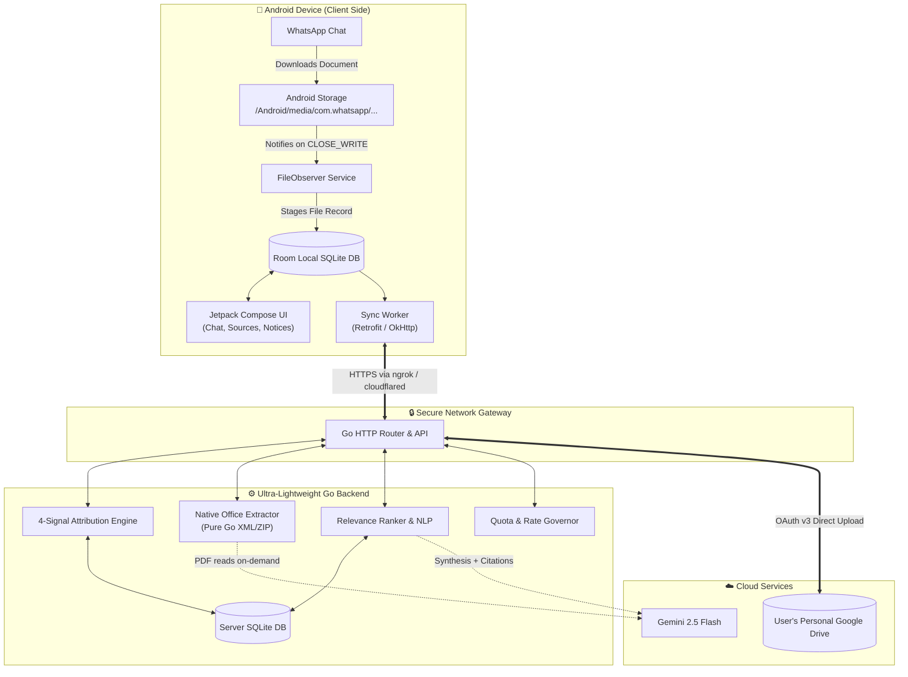
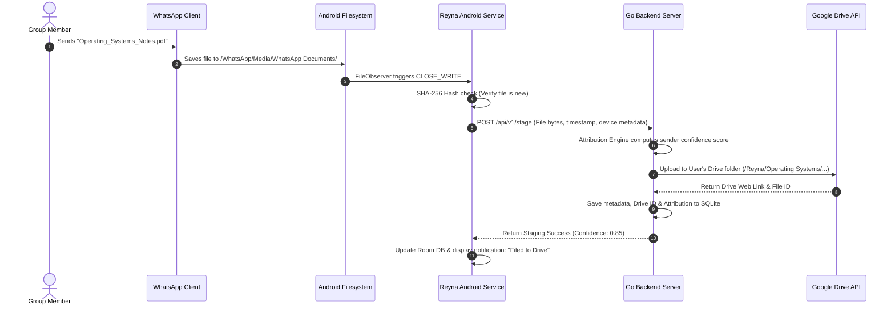
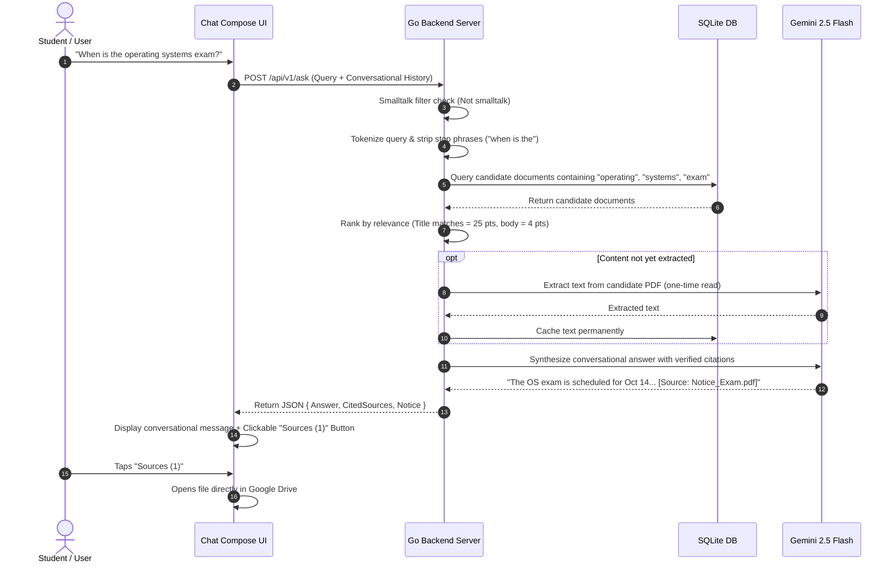
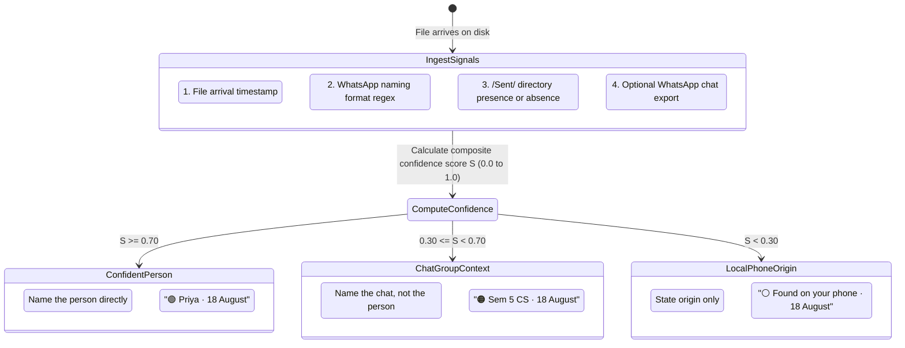
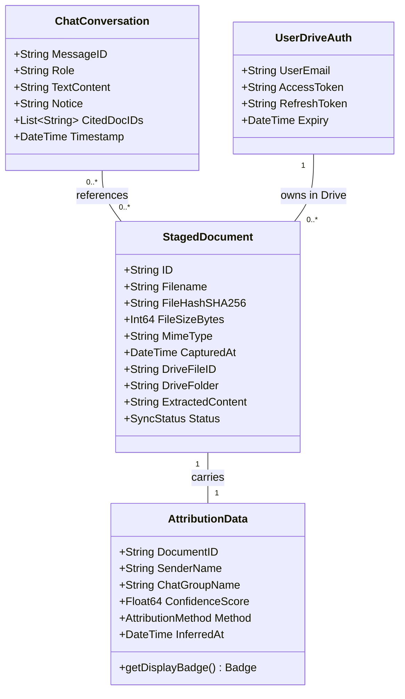

# Reyna — "Git for your WhatsApp Group"

> **The project file you need is already on your phone.**
> Reyna turns messy, chaotic WhatsApp groups into an organized, searchable digital archive—with zero manual uploads, zero bots in your chat, and automated Google Drive backup.

[](./ARCHITECTURE.html)
[](./ARCHITECTURE.md)
[](https://sih.gov.in)

---

## 📖 1. What is Reyna in Plain English?

In over 46,000 colleges and universities across India, student collaboration doesn't happen on enterprise software—it happens on **WhatsApp groups**. Lecture notes, past question papers (PYQs), lab codes, and assignment briefs are shared daily.

Within 24 hours, those vital documents are buried under hundreds of memes, chats, and good-morning stickers. When exam season or project reviews arrive, students spend hours frantically scrolling or asking: *"Can someone please re-send the Module 2 notes?"*

### Why Traditional Portals Fail
Universities spend millions building upload portals. **Almost nobody uses them.** Students have to remember passwords, convert files, log into clunky interfaces, and fill out endless metadata forms. Because friction is high, portals sit empty.

### The Reyna Breakthrough: Zero Upload Required
Reyna completely flips the script:

1. **No Manual Uploads:** You don't upload anything. An Android background service quietly watches the local storage directory WhatsApp already downloads files to.
2. **No Bots in the Group:** No bot phone number joins your group chat. WhatsApp cannot ban your account, and your private conversations remain private.
3. **Automated Google Drive Backup:** As soon as a file finishes downloading, Reyna organizes and backs it up directly into **your personal Google Drive**.
4. **Who Shared It? (Attribution):** Files saved to disk have no sender label. Reyna correlates timestamps, filename signatures, and sent folders to reconstruct who shared the file with mathematical confidence.
5. **Ask in Plain English:** Months later, simply ask: *"Where are the notes for Module 1 ODE?"* Reyna finds the exact file, cites the person who shared it, gives you a one-tap button to open it, and remembers context across follow-up questions.

---

## ⚖️ Comparison Matrix

| Dimension | Traditional College Portals | Traditional WhatsApp Bots | Reyna (Our Solution) |
| :--- | :--- | :--- | :--- |
| **Upload Friction** | ❌ High (Manual login, forms, uploads) | ⚠️ Medium (Must forward to bot) | ✅ **Zero (Automatic background capture)** |
| **WhatsApp Ban Risk** | N/A | ❌ High (Meta bans automated bots) | ✅ **Zero (No bot joins chat; uses OS storage)** |
| **Document Privacy** | ⚠️ Stored on central servers | ❌ Stored on third-party server | ✅ **100% Private (User's own Google Drive)** |
| **Attribution** | ⚠️ Only shows who uploaded | ⚠️ Only shows who messaged bot | ✅ **4-Signal forensic confidence scoring** |
| **Search Experience** | ❌ Rigid keyword title match | ⚠️ Basic text pattern match | ✅ **Conversational AI + Verified Citations** |

---

## 🏛️ 2. System Architecture & UML Diagrams

Reyna consists of a lightweight **Android client** (Kotlin + Jetpack Compose + Room SQLite), an ultra-fast **Go backend server** (Go 1.22+ with only 2 external dependencies), and integrations with **Google Drive API v3** and **Gemini 2.5 Flash**.

### 2.1 High-Level Component Diagram



---

### 2.2 Sequence Diagram: Automated Ingestion & Cloud Backup

How a document moves from a classmate's WhatsApp message into the student's Google Drive:



---

### 2.3 Sequence Diagram: Conversational Search & Verified Citations

How Reyna answers questions with verified citations without hallucinating:



---

## 🎯 3. The 4-Signal Attribution Engine

When a file is downloaded by WhatsApp onto disk, the operating system discards the sender's identity. Reyna acts as a digital forensic investigator, combining **four independent signals** to calculate a confidence score between `0.0` and `1.0`:

1. **Arrival Timestamp Correlation:** Comparing file creation timestamps with local chat sync events.
2. **WhatsApp Naming Conventions:** Parsing automatic media numbering and export signatures.
3. **`/Sent/` Directory Check:** Distinguishing whether the document was received or sent by the user.
4. **Optional Chat Export Ground Truth:** One-time import of chat exports to achieve 100% precision ground truth.



### The Golden Rule of Attribution
> **"A wrong name is infinitely worse than no name."**
If attribution confidence is below `0.70`, Reyna strictly refuses to guess a person's name. It downgrades cleanly to group-level or phone-level origin.

---

## 📊 4. Core Data Models (UML Class Diagram)



---

## 🚀 5. Quick Start & Setup

### Prerequisites
- **Go 1.22+**
- **Android SDK & Command-Line Tools** (API 34+)
- **Google Cloud Console Account** (Free tier, Google Drive API v3 enabled)

### Running the Go Backend
```bash
# Clone the repository
git clone https://github.com/hurshnarayan/reyna-git-for-whatsapp.git
cd reyna-git-for-whatsapp/backend

# Configure environment
cp ../.env.example .env
# Add GOOGLE_CLIENT_ID, GOOGLE_CLIENT_SECRET, GEMINI_API_KEY to .env

# Run server
go run ./cmd/server/main.go
```

### Running the Android Client
```bash
cd android
./gradlew installDebug
```

---

## 📚 Further Documentation

- **[ARCHITECTURE.html](./ARCHITECTURE.html)**: Interactive, beautifully styled visual guide with responsive tabs, live Mermaid diagrams, and plain-English walk-throughs. Open in any browser!
- **[ARCHITECTURE.md](./ARCHITECTURE.md)**: Full engineering design specification and architectural deep dive.

---

## 👥 Team Reyna (Smart India Hackathon 2026)

* **Yash Vardhan Dixit**
* **Harsh Narayan**
* **Aditya Rai**
* **Chinmayi M.**
* **Gopi Thakur**
* **Prasanjeet Kumar**

---

## 📄 License
MIT License. Free forever. Your data stays in **your** Google Drive.
